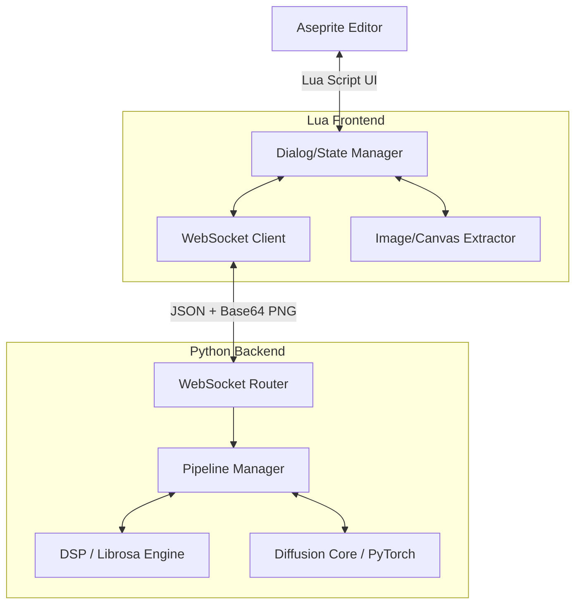
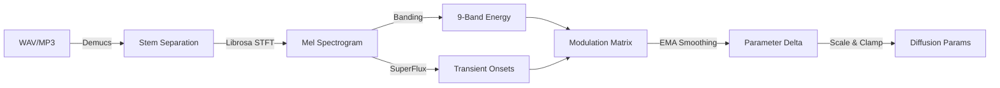

# SDDj Architecture

SDDj is built on a split-architecture model: a lightweight Lua UI running inside Aseprite communicating over WebSockets to a heavyweight Python backend handling all ML and DSP operations.

## High-Level System Design

## Extension Layer (Lua)

The extension avoids heavy lifting. Its primary responsibilities are:
1. Drawing the UI using Aseprite's Dialog API.
2. Managing the persistence of user settings between sessions.
3. Extracting layers/frames to Base64 PNGs for `img2img` and ControlNet workflows.
4. Parsing incoming generate payloads and injecting pixels into the active Cel.

**Key modules:**
- `sddj_dialog.lua`: Constructs the massive 4-tab UI.
- `sddj_state.lua`: Holds the current memory state of the dialog and syncs with `settings.json`.
- `sddj_ws.lua`: Non-blocking WebSocket listener using Aseprite's internal WS implementation.

## Server Layer (Python)

The backend is built around `asyncio`/FastAPI (for the WebSocket layer) and PyTorch (for the ML layer). Because diffusion inference is blocking (and mostly saturates the GIL despite C++ extensions), generation requests are offloaded to an `asyncio.to_thread` pool equipped with a system-wide GPU lock to serialize VRAM access.

### Diffusion Pipeline

The core engine uses `diffusers` optimized to the absolute limit:

1. **UNet Compilation**: The UNet is passed through `torch.compile` using Triton codegen.
2. **Feature Caching**: `DeepCache` wraps the compiled UNet to reuse high-frequency features across steps.
3. **Frequency Enhancement**: `FreeU v2` manipulates skip connections to enhance structural fidelity without training.
4. **Distillation**: `AnimateDiff-Lightning` and `Hyper-SD` LoRAs compress the required step count from 20 to 4-8.

#### Attention Mechanism

PyTorch ≥ 2.0 uses `scaled_dot_product_attention` (SDP) **by default** in diffusers — no configuration needed. SDP auto-dispatches to the best available kernel:

- **FlashAttention2** kernels (integrated in PyTorch ≥ 2.2) — fused, memory-efficient
- **Math fallback** — for unsupported head dimensions

A separate `flash-attn` package is **not required** — PyTorch ≥ 2.1 includes FA2 natively via SDP. xformers is superseded by native SDP and provides no benefit on PyTorch ≥ 2.0.

### Audio DSP Pipeline

The audio reactivity engine (`audio_analyzer.py` and `modulation_engine.py`) transforms audio streams into visual parameters in real-time.

**Key DSP choices:**
- **44.1kHz / 256 hop**: High-resolution features (~172 fps parameter update rate).
- **ITU-R BS.1770 K-Weighting**: Pre-filter ensures energy tracking matches human perceptual loudness.
- **EMA / Savitzky-Golay Smoothing**: Control signal smoothing prevents high-frequency parameter jitter from destroying UNet coherency in animations.

## Concurrency Model

Aseprite users will routinely cancel generations or trigger rapid parameter changes. 

1. **Cancellation**: A global `asyncio.Event` (`stop_event`) is passed down to the diffusion callback loop. If signaled via the WebSocket `CANCEL` command, the `callback_on_step_end` hook raises a custom interrupt exception, freeing the GPU instantly.
2. **Watchdog**: The WebSocket maintains a ping/pong heartbeat. If the client disconnects (e.g., Aseprite crashes), the server intercepts the disconnect, signals the `stop_event`, and resets internal state within seconds.

## File Structure Hierarchy

The project avoids bloated deep trees by centralizing logic into clear domain boundaries:

- `sddj/server/` — Python 3.11+ backend.
  - `engine/` — SOTA diffusion orchestrators (`core.py`, `animation.py`, `audio_reactive.py`).
  - `pipeline_factory.py` — Dynamic model routing, torch.compile tracing, scheduler swaps.
  - `audio_analyzer.py` / `modulation_engine.py` — DSP and param scheduling.
  - `postprocess.py` — Pixel art rendering stages.
  - `models/` — Local weight storage (no runtime downloads).
- `sddj/extension/` — Lua UI for Aseprite.
  - `scripts/` — Subdivided modules (`sddj_ws.lua` for transport, `sddj_dialog.lua` for UI).
