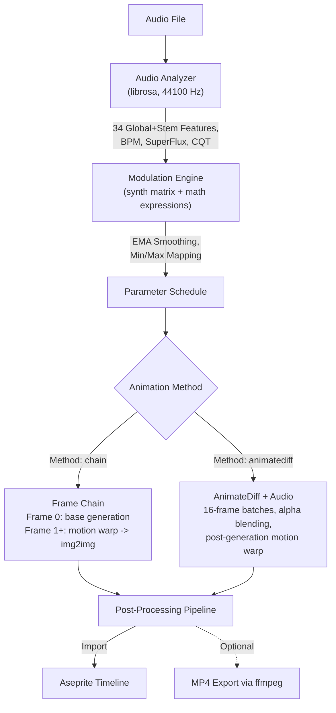

# Audio Reactivity Guide

Generate SD-driven animations where inference parameters are modulated in real-time by audio features. This system is inspired by Deforum's audio-reactive workflows, brought to Aseprite.

---

## Overview

Audio reactivity maps characteristics of an audio file (energy, beats, spectral content) to generation parameters (denoise strength, CFG scale, noise, seed). The result: animations that breathe, pulse, and evolve with the music.

**Architecture:**

## Quick Start

1. **Connect** to the server
2. Open the **Audio** tab
3. **Select** an audio file (.wav, .mp3, .flac, .ogg)
4. Click **Analyze** — displays duration, frame count, BPM, available features, and auto-selects the recommended preset
5. Optionally set **Max Frames** to limit the number of generated frames (0 = all)
6. Click **AUDIO GEN** — generates an animation frame-by-frame

That's it. The auto-calibration system picks the best preset for your audio.

## Workflow

### 1. Audio Analysis

Click **Analyze** after selecting a file. The server:

- Loads the audio (mono, 44100 Hz — configurable)
- Extracts 34 global features normalized to [0, 1] (9 frequency bands, 5 spectral timbral, 12 chroma, 4 core, 3 backward-compat aliases, beat)
- Applies K-weighting pre-filter (ITU-R BS.1770) for perceptual loudness on energy features
- Detects BPM via librosa (or madmom RNN if installed)
- Optionally separates stems (drums, bass, vocals, other) via demucs — each stem gets all 34 features
- Caches results for 24 hours (cache key includes DSP config — changing settings auto-invalidates)

The status bar shows: `12.5s | 300 frames | 8 features | 128 BPM`

### 2. Preset Selection

After analysis, the system auto-selects the recommended preset based on audio characteristics. You can override by choosing from the dropdown.

### 3. Generation

Click **AUDIO GEN**. Each frame:
1. Reads modulated parameters from the schedule
2. Resolves the prompt (static or from prompt schedule)
3. Generates via img2img from the previous frame (or txt2img for frame 0)
4. Applies post-processing
5. Imports into Aseprite timeline

The cancel button works at any point — the server acknowledges immediately.

## Auto-Calibration

When you click **Analyze**, the server examines audio characteristics and recommends the best preset:

| Audio Characteristic | Recommended Preset |
|---------------------|-------------------|
| Very quiet, minimal dynamics | `ambient_drift` |
| Fast BPM (>120) + bright spectrum | `electronic_pulse` |
| Fast BPM (>120) + dark spectrum | `hiphop_bounce` |
| High onset + loud peaks | `rock_energy` |
| Bass-heavy | `bass_driven` |
| Strong dynamic variation + onsets | `rhythmic_pulse` |
| Low energy + minimal variation | `classical_flow` |
| Very percussive | `glitch_chaos` |
| Other | `beginner_balanced` |

The recommendation auto-selects in the dropdown. You can always override.

---
> **For advanced targets, the modulation matrix, list of presets, and math expressions, see the [Audio Reference](AUDIO-REFERENCE.md).**
