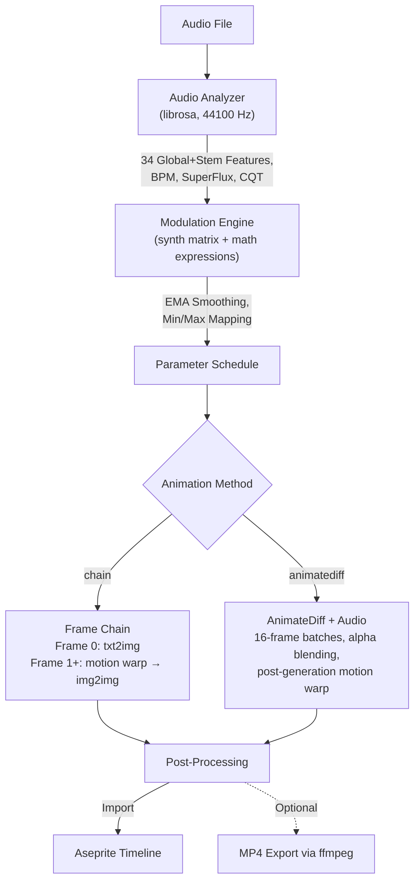

# Audio Reactivity

Generate animations where diffusion parameters are modulated in real-time by audio features — Deforum-style, inside Aseprite.

---

## Overview



---

## Quick Start

1. **Connect** to the server
2. Open the **Audio** tab
3. **Select** an audio file (.wav, .mp3, .flac, .ogg, .m4a, .aac)
4. Click **Analyze** — displays duration, frame count, BPM, features, and auto-selects the recommended preset
5. Optionally set **Max Frames** to limit generated frames (0 = all)
6. Click **AUDIO GEN**

The Audio tab has its own dedicated **Steps**, **CFG**, and **Strength** sliders. Supports all generation modes (txt2img, img2img, inpaint, ControlNet) and both animation methods.

### Default Parameters

| Parameter | Default | Range |
|-----------|---------|-------|
| FPS | 24 | 1–60 |
| Steps | 8 | 1–50 |
| CFG | 5.0 | 0.0–30.0 |
| Denoise Strength | 0.50 | 0.00–1.00 |
| Max Frames | 0 (all) | 0–9999 |

---

## Analysis

Click **Analyze** after selecting a file. The server:

- Loads the audio (mono, 44100 Hz configurable)
- Extracts **34 global features** normalized to [0, 1]
- Applies **K-weighting pre-filter** (ITU-R BS.1770) for perceptual loudness on energy features
- Detects **BPM** via librosa (or madmom RNN if installed)
- Optionally separates **stems** (drums, bass, vocals, other) via demucs — each stem gets all 34 features
- **Caches** results for 24 hours (cache key includes DSP config — changing settings auto-invalidates)

Status bar shows: `12.5s | 300 frames | 8 features | 128 BPM`

### Auto-Calibration

After analysis, the system auto-selects the best preset based on audio characteristics:

| Audio Characteristic | Recommended Preset |
|---------------------|-------------------|
| Very quiet, minimal dynamics | `ambient_drift` |
| Fast BPM (>120) + bright spectrum | `electronic_pulse` |
| Fast BPM (>120) + dark spectrum | `hiphop_bounce` |
| High onset + loud peaks | `rock_energy` |
| Bass-heavy | `bass_driven` |
| Strong dynamic variation + onsets | `rhythmic_pulse` |
| Low energy + minimal variation | `classical_flow` |
| Very percussive | `glitch_chaos` |
| Other | `beginner_balanced` |

---

## Modulation Matrix

### Sources

Audio features extracted per frame, normalized to [0, 1]:

| Source | Description | Best For |
|--------|-------------|----------|
| `global_rms` | Overall energy (K-weighted loudness) | General reactivity |
| `global_onset` | Transient/attack strength (SuperFlux) | Beat-driven effects |
| `global_centroid` | Spectral brightness | Timbral changes |
| `global_beat` | Beat impulse (BPM-aligned) | Rhythmic sync |
| **9-band frequency segmentation** | | |
| `global_sub_bass` | 20–60 Hz | Deep bass, kick drums |
| `global_bass` | 60–150 Hz | Bass lines |
| `global_low_mid` | 150–400 Hz | Warmth, body |
| `global_mid` | 400 Hz–2 kHz | Melodic content |
| `global_upper_mid` | 2–4 kHz | Vocal presence, guitar |
| `global_presence` | 4–8 kHz | Clarity, sibilance |
| `global_brilliance` | 8–12 kHz | Shimmer, harmonics |
| `global_air` | 12–20 kHz | Airiness, spatial |
| `global_ultrasonic` | 20–22 kHz | Edge detection |
| **Backward-compat aliases** | | |
| `global_low` | sub_bass + bass + low_mid average | Bass-driven effects |
| `global_high` | presence + brilliance + air + ultrasonic average | Hi-hat, cymbal reactivity |
| **Spectral timbral** | | |
| `global_spectral_contrast` | Peak-vs-valley across bands | Timbral dynamics |
| `global_spectral_flatness` | Tonality (0=tone, 1=noise) | Noise-driven effects |
| `global_spectral_bandwidth` | Frequency spread around centroid | Timbral width |
| `global_spectral_rolloff` | Frequency below which 85% energy | Brightness ceiling |
| `global_spectral_flux` | Frame-to-frame timbral change | Timbral transitions |
| **CQT chromagram** | | |
| `global_chroma_C` … `global_chroma_B` | 12 individual pitch classes | Key-aware modulation |
| `global_chroma_energy` | Aggregate chroma energy | Harmonic density |

**Per-stem features** (requires demucs): each stem (`drums_*`, `bass_*`, `vocals_*`, `other_*`) gets all 34 features above with its name as prefix.

### Targets

| Target | Range | Effect |
|--------|-------|--------|
| `denoise_strength` | 0.20–0.95 | How much each frame changes from the previous |
| `cfg_scale` | 1.0–30.0 | Prompt adherence |
| `noise_amplitude` | 0.0–1.0 | Additive latent noise — visual turbulence |
| `controlnet_scale` | 0.0–2.0 | ControlNet conditioning strength |
| `seed_offset` | 0–1000 | Per-frame seed variation — visual jumps |
| `palette_shift` | 0.0–1.0 | Audio-driven hue rotation |
| `frame_cadence` | 1–8 | Frame skip cadence (higher = fewer generated frames) |
| `motion_x` | -5.0–5.0 | Horizontal pan (pixels) |
| `motion_y` | -5.0–5.0 | Vertical pan (pixels) |
| `motion_zoom` | 0.92–1.08 | Zoom factor (1.0 = none, >1 = in, <1 = out) |
| `motion_rotation` | -2.0–2.0 | Rotation (degrees) |
| `motion_tilt_x` | -3.0–3.0 | Perspective pitch — faux 3D via homography warp |
| `motion_tilt_y` | -3.0–3.0 | Perspective yaw — faux 3D via homography warp |

> [!NOTE]
> **Motion anti-spaghetti**: amplitude is auto-scaled by `denoise_strength` (clamped 0.15–0.8). Frame-to-frame deltas are rate-limited per channel with total motion budget enforcement. Border replication + Lanczos4 interpolation ensure clean edges.

### Attack / Release

Each modulation slot has asymmetric EMA smoothing:

- **Attack** (1–30): how fast the parameter responds to rising audio. Low = snappy.
- **Release** (1–60): how fast it returns when audio drops. High = smooth tails.

Typical values: attack=2, release=8. Invert checkbox inverts source (1−x) before mapping.

---

## Presets

### Genre-Specific

| Preset | Slots | Best For |
|--------|-------|----------|
| `electronic_pulse` | beat→denoise, onset→cfg, high→noise, beat→zoom | EDM, techno, synth |
| `rock_energy` | rms→denoise, onset→cfg, low→seed, rms→motion_x | Rock, metal, live |
| `hiphop_bounce` | low→denoise, beat→cfg, onset→noise, low→motion_y | Hip-hop, trap, bass |
| `classical_flow` | rms→denoise, centroid→cfg, rms→motion_x | Orchestral, piano |
| `ambient_drift` | rms→denoise, centroid→cfg, mid→noise, mid→motion_x, rms→zoom | Ambient, drone |

### Style-Specific

| Preset | Slots | Best For |
|--------|-------|----------|
| `glitch_chaos` | onset→denoise, high→cfg, beat→seed, rms→noise, onset→rotation | Glitch, experimental |
| `smooth_morph` | rms→denoise, centroid→cfg, rms→zoom | Gentle transitions |
| `rhythmic_pulse` | beat→denoise, onset→cfg, beat→zoom | Beat-synced pulsing |
| `atmospheric` | rms→denoise, mid→cfg, high→noise, mid→motion_x | Moody, cinematic |
| `abstract_noise` | rms→noise, onset→denoise, centroid→seed, high→cfg, high→rotation, onset→motion_x, high→tilt_x | Abstract, generative |

### Complexity Levels

| Preset | Slots | Best For |
|--------|-------|----------|
| `one_click_easy` | 1 (rms→denoise) | First-time users |
| `beginner_balanced` | 2 (rms→denoise, onset→cfg) | Good starting point |
| `intermediate_full` | 3+1 (rms→denoise, onset→cfg, low→noise, beat→zoom) | Rich modulation |
| `advanced_max` | 4+3 (all targets + seed, motion, tilt) | Maximum expressiveness |

### Target-Specific

| Preset | Slots | Best For |
|--------|-------|----------|
| `controlnet_reactive` | rms→cn_scale, onset→denoise | ControlNet + audio |
| `seed_scatter` | onset→seed, rms→denoise | Visual variety per beat |
| `noise_sculpt` | rms→noise, onset→denoise, centroid→cfg, rms→zoom | Noise-driven textures |

### Motion / Camera

| Preset | Slots | Best For |
|--------|-------|----------|
| `gentle_drift` | rms→denoise, low→motion_x, mid→motion_y | Slow drift |
| `pulse_zoom` | rms→denoise, beat→zoom | Beat-synced zoom |
| `slow_rotate` | rms→denoise, centroid→rotation | Timbre-driven rotation |
| `cinematic_sweep` | rms→denoise, low→motion_x, beat→zoom, centroid→rotation, centroid→tilt_y | Full cinematic camera |
| `cinematic_tilt` | rms→denoise, low→tilt_x, centroid→tilt_y | Perspective tilt |
| `zoom_breathe` | rms→denoise, rms→zoom | RMS-driven zoom |
| `parallax_drift` | rms→denoise, low→motion_x, mid→tilt_x | Parallax (pan + tilt) |
| `full_cinematic` | rms→denoise, low→motion_x, mid→motion_y, beat→zoom, centroid→rotation, low→tilt_x | All 6 motion channels |

### Spectral

| Preset | Slots | Best For |
|--------|-------|----------|
| `spectral_sculptor` | flatness→noise, contrast→denoise, bandwidth→cfg | Timbral sculpting |
| `tonal_drift` | chroma→denoise, centroid→cfg, rolloff→palette, bandwidth→zoom | Melodic, harmonic content |
| `ultra_precision` | onset(1/3)→denoise, contrast→cfg, sub_bass→zoom, presence→noise | Maximum attack precision |
| `micro_reactive` | bass→zoom, low_mid→denoise, brilliance→noise, flux→cfg | Sub-band micro-reactivity |

### Legacy

| Preset | Description |
|--------|-------------|
| `energetic` | v0.7.0 (rms→denoise, onset→cfg, rms→motion_x) |
| `ambient` | v0.7.0 (rms→denoise, centroid→cfg, centroid→motion_x) |
| `bass_driven` | v0.7.0 (low→denoise, high→cfg, low→motion_y) |

### Voyage / Journey

| Preset | Slots | Best For |
|--------|-------|----------|
| `voyage_serene` | rms→denoise, mid→motion_x, rms→zoom, centroid→palette_shift | Slow ambient journeys |
| `voyage_exploratory` | rms→denoise, low→motion_x, mid→motion_y, centroid→rotation, rolloff→palette_shift | Mid-energy exploration |
| `voyage_dramatic` | beat→denoise, onset→cfg, low→motion_x, beat→zoom, rms→rotation | High-energy drama |
| `voyage_psychedelic` | rms→denoise, contrast→cfg, low→motion_x, mid→motion_y, rms→zoom, centroid→rotation, low→tilt_x, chroma→palette_shift | Full psychedelic experience |

### Rest-Aware (Energy-Gated)

| Preset | Slots | Best For |
|--------|-------|----------|
| `intelligent_drift` | rms→denoise, rms→motion_x, rms→motion_y, rms→zoom | Auto-pauses motion during silence |
| `reactive_pause` | beat→denoise, beat→zoom, beat→rotation | Beat-gated — motion only on beat impulses |

---

## Expressions

Expressions override slot values with math formulas. Enable via **Advanced → Custom Expressions**.

### Functions

| Category | Functions |
|----------|-----------|
| **Core math** | `sin`, `cos`, `tan`, `abs`, `min`, `max`, `sqrt`, `exp`, `log`, `pow`, `floor`, `ceil`, `sign`, `atan2` |
| **Interpolation** | `clamp(x, lo, hi)`, `lerp(a, b, t)`, `mix(a, b, t)`, `smoothstep(e0, e1, x)`, `remap(x, a, b, c, d)` |
| **Conditionals** | `where(cond, a, b)` |
| **Easing** | `easeIn`, `easeOut`, `easeInOut`, `easeInCubic`, `easeOutCubic` |
| **Animation** | `bounce(x)`, `elastic(x)` |
| **Utility** | `step(x, n)`, `fract(x)`, `pingpong(x, len)`, `hash1d(x)`, `smoothnoise(x)` |

### Variables

| Variable | Description |
|----------|-------------|
| `t` | Frame index (0, 1, 2…) |
| `max_f` | Total frame count |
| `fps` | Frames per second |
| `s` | Seconds elapsed (`t / fps`) |
| `bpm` | Detected BPM |
| `global_rms`, `global_onset`, `global_centroid`, `global_beat` | Current frame's feature values |
| `global_low`, `global_mid`, `global_high` | Band energies |
| `global_sub_bass`, `global_upper_mid`, `global_presence` | Extended bands |
| `global_spectral_contrast`, `spectral_flatness`, `spectral_flux`, `spectral_rolloff`, `spectral_bandwidth` | Spectral features |
| `global_chroma_energy` | Chromagram energy |
| Per-stem variables | Available if stems enabled |

### Examples

```
# Denoise pulsing at BPM
0.2 + 0.4 * abs(sin(s * 3.14159 * bpm / 60))

# CFG follows spectral brightness with floor
max(3.0, 5.0 + 4.0 * global_centroid)

# Noise only on beats
where(global_beat > 0.3, 0.5, 0.0)

# Gradual denoise increase over time
lerp(0.15, 0.65, t / max_f)

# Zoom pulse on beats
1.0 + 0.02 * global_beat

# Horizontal drift following bass
global_low * 3.0 - 1.5
```

### Expression Presets

Select from **30 curated presets** across 5 categories (rhythmic, temporal, spectral, easing, camera) via the **Expr Preset** dropdown.

### Camera Choreography

Select from **7 multi-target camera presets** via **Camera Journey**: orbit, dolly zoom, crane, wandering voyage, hypnotic spiral, breathing calm, staccato cuts. Each choreography hydrates modulation slots + expression fields simultaneously.

---

## AnimateDiff + Audio

Combines AnimateDiff's temporal attention (16-frame window) with audio-driven modulation for superior temporal coherence.

1. The timeline is divided into **16-frame chunks** with **4-frame overlap**
2. Modulation parameters are **averaged per chunk**
3. Each chunk is generated via AnimateDiff with those parameters
4. Overlaps are **alpha-blended** for smooth transitions
5. FreeInit can be applied to the first chunk

| Method | Best For |
|--------|----------|
| **Frame Chain** | Short clips (<5s), maximum per-frame control, fast iteration |
| **AnimateDiff + Audio** | Longer sequences, temporal coherence, smoother motion |

To use: in the Audio tab, set **Method** to `animatediff`. Minimum useful sequence: 16 frames.

---

## Prompt Schedule

Prompt scheduling evolves the generation prompt across frames — different scenes, styles, or subjects at different points in the timeline.

### Keyframe Scheduling (New)

Define frame-indexed keyframes with transition modes. Works in **all generation modes** (Generate, Animation, Audio).

| Field | Description |
|-------|-------------|
| `[time]` | Time bracket: frame (`[10]`), seconds (`[2.5s]`), or percent (`[50%]`) |
| `prompt` | Positive prompt (multi-line supported) |
| `--` | Negative prompt for this keyframe (overrides global) |
| `blend: N` | Blend window length to crossfade between prompts |
| `weight: N` | Target guidance weight at this keyframe |

**Example** — 3-act animation with a blended transition:
```
[0]
pixel art forest, morning light

[5]
blend: 3
pixel art ocean, sunset

[10]
pixel art volcano, dramatic sky
```

Frames 0–4 show the forest. Frames 5–7 alternate between forest and ocean (visual crossfade via img2img chain). Frames 8+ show the ocean, then volcano from frame 10.

#### Built-in Presets

| Preset | Structure | Transitions |
|--------|-----------|-------------|
| `evolving_3act` | 3 keyframes (0, 3, 6) | All hard_cut |
| `style_morph_4` | 4 keyframes (0, 2, 5, 8) | 3 blends (2-frame window) |
| `beat_alternating` | 2 keyframes (0, 4) | All hard_cut |
| `slow_drift` | 2 keyframes (0, 4) | 1 blend (4-frame window) |
| `rapid_cuts_6` | 6 keyframes (0, 2, 4, 6, 8, 10) | All hard_cut |

Presets are structural — prompts are empty by default. Fill them manually or use **Auto-Fill** (server-side `PromptGenerator` fills empty keyframes with varied prompts based on randomness level).

#### Precedence

`prompt_schedule` (keyframes) > `prompt_segments` (legacy) > static `prompt`.

### Time-Range Segments (Legacy)

For audio-reactive mode, time-based segments still work. Format: `start-end` in seconds paired with a prompt.

```
T1: 0-8   / serene forest, green canopy, morning light
T2: 8-16  / dark cave, glowing crystals, underground
T3: 16-24 / volcanic landscape, flowing lava, dramatic sky
```

The default prompt (Generate tab) covers any time not matched by segments.

### Audio-Linked Randomness

When the **Randomness** slider (0–20) is set above 0 and no manual segments are defined, SDDj auto-generates varied prompt segments aligned to the music's structure:

| Randomness | Segments | Effect |
|------------|----------|--------|
| 0 | 0 | Single prompt throughout |
| 1–5 | 2 | Subtle variation |
| 6–10 | 3 | Moderate: three scenes |
| 11–15 | 4–5 | Wild: frequent changes |
| 16–20 | 6–8 | Chaos: rapid shifts |

Longer audio increases segments proportionally (capped at 12). Boundaries snap to BPM beat grid. The subject from your base prompt is locked; surrounding descriptors vary.

---

## Stems

Optional CPU-based stem separation via demucs (htdemucs model).

- **Install**: `pip install demucs>=4.0`
- **Performance**: ~20–60 seconds per minute of audio (first run, then cached 24h)
- **Available stems**: drums, bass, vocals, other — each gets all 34 features
- **When to use**: specific instrument reactivity (e.g., drums → denoise, vocals → CFG)

---

## MP4 Export

After generating, click **Export MP4** to create a video with audio track embedded.

**Requires**: ffmpeg in PATH.

| Quality | CRF | Preset | Scale | Best For |
|---------|-----|--------|-------|----------|
| `web` | 23 | medium | 4× | Social media, small file |
| `high` | 17 | slow | 4× | Sharing, good quality/size |
| `archive` | 12 | veryslow | 8× | Archival, maximum quality |
| `raw` | 0 | ultrafast | 1× | Lossless, no scaling |

Pixel art is upscaled with **nearest-neighbor** (no blur). Metadata (prompt, seed) is embedded in the MP4.

---

## Seed Control

- **Fixed seed**: set in Generate tab — same base for all frames, only seed_offset varies
- **Random seed per frame**: injects expression `t * 7 + floor(global_rms * 500)`
- **Manual**: use a modulation slot with `seed_offset` target, or custom expression

## img2img / ControlNet with Audio

The generation mode from the Generate tab applies to audio generation:

| Mode | Frame 0 | Frame 1+ |
|------|---------|----------|
| txt2img | Generated from scratch | Chain via img2img |
| img2img | Active layer as source | Chain |
| inpaint | Source + mask | Chain |
| ControlNet | Control image | Chain via img2img |

---

## Tips

### Denoise Strength
- **0.10–0.30**: Stable, gradual evolution — ambient, backgrounds
- **0.40–0.80**: Dynamic, each frame distinct — energetic music
- Rule of thumb: keep max below **0.70** for coherent animations
- Sub-floor blending (v0.8.7): when modulation drives denoise below the quality floor, the engine generates at the floor and blends toward the source — preserving full dynamic range

### CFG Scale
- **2–5**: Dreamy, abstract
- **6–12**: Prompt-faithful, clear subject
- Modulated by onset: creates "attention peaks" on beats

### Noise Amplitude
- Use sparingly (0.0–0.3 typical). Best paired with low denoise

### Motion / Camera
- Motion is **auto-dampened** by denoise strength — low denoise = minimal movement
- Deltas are **rate-limited** per channel to prevent saccade from transients
- Conservative ranges for pixel art: ±2–3 px translation, zoom 0.99–1.01, rotation ±1°, tilt ±1.5°
- Combining `motion_zoom` + `global_beat` = satisfying pulse-zoom

### Attack / Release Tuning
| Music Type | Attack | Release |
|------------|--------|---------|
| Fast | 1 | 3–6 |
| Slow | 4–8 | 15–30 |
| Percussive | 1 | 1–2 |
| Ambient | 6–10 | 20–30 |

### Common Pitfalls
- Don't set denoise max above 0.90 — incoherent animation
- Don't use all slots targeting the same parameter — they average, reducing range
- Always **Analyze** before generating — the server needs the analysis cache
- Very short clips (<2s) may lack dynamic range for visible modulation

**Troubleshooting:**

| Problem | Solution |
|---------|----------|
| Audio file not found | Use absolute path |
| Stem separation unavailable | `pip install demucs>=4.0` |
| Modulation too subtle | Increase min/max range or try wider preset (`glitch_chaos`) |
| Modulation too aggressive | Increase release frames, decrease max range |
| Quiet passages too dynamic | Sub-floor blending handles this. If still too dynamic, lower slot max |
| MP4 export fails | Install ffmpeg, ensure in PATH. Set `SDDJ_FFMPEG_PATH` if needed |
| Audio/video desync | Ensure audio FPS and generation FPS match |
| "Analysis failed" | Check server logs; ensure librosa installed, audio file not corrupted |
| Color drift in long chains | Increase `SDDJ_COLOR_COHERENCE_STRENGTH` (0.3–0.7) |
| Animation too jittery | Enable `SDDJ_OPTICAL_FLOW_BLEND=0.2`, lower denoise (0.15–0.25) |
